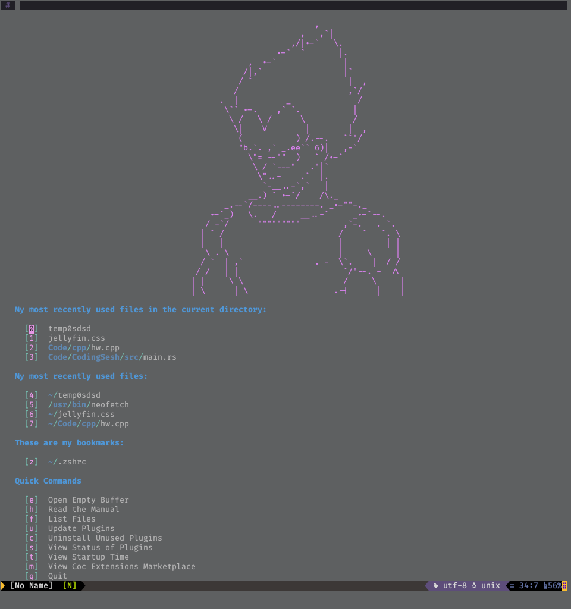

# Super Sayain Vim Config

Vim with Super Sayain Performance

Lean mean Neo/vim machine, 27-35ms startup time.

Best with Neovim or Vim 8 with +python3 extensions enabled.

## Features

- Robust, yet light-weight
- Use (neo)vim builtin package manager
- Fast Startup (27-34ms)
    - Lazy Loading 57% of plugins (34/60)
- Watch code execute and automatically disappear (try it out! <kbd>F9</kbd>)
- Modular configuration
- [Intellisense engine autocompletion](https://github.com/neoclide/coc.nvim)
- Ultimate Linting, Code Formating, & Language Support
- Central location for tags
- Awesome Startpage(thanks to [startify](https://github.com/mhinz/vim-startify))
- Markdown Previewer(custom css)
- Auto Shebang
- Code Runner & Compiler
- Can determine filetype for files with no extensions(via shebang)

## Screenshots


## Pre-requisites

- Python 3
- Python 2
- Rust (curl --proto '=https' --tlsv1.2 -sSf https://sh.rustup.rs | sh)
- Neovim (Recommended) / Vim 8+
- [Just](https://github.com/casey/just)
- yarn (for coc.vim)
- Your Compiler and/or Interpreter
- Your favorite Language Servers, Linters, Code Formatters

## Install

[1.] Let's clone this repo! Clone to `~/.config/nvim`,
we'll also symlink it for Vim:

```sh
mkdir ~/.config
git clone git://github.com/Th3Whit3Wolf/SS-Vim.git ~/.config/nvim
cd ~/.config/nvim
ln -s ~/.config/nvim ~/.vim  # For Vim8
just install
```

- _**Note:**_ If your system sets `$XDG_CONFIG_HOME`,
  use that instead of `~/.config` in the code above.
  Nvim follows the XDG base-directories convention.

[1.] Install extensions from below to get better autocompletion and linting

Enjoy!

### Recommended Fonts

| Ligature Fonts    | No Ligatures but Awesome |
| ----------------- | ------------------------ |
| [Fira Code](https://github.com/tonsky/FiraCode) (free) |  [IBM Plex Mono](https://github.com/IBM/plex) (free) |
| [Hasklig](https://github.com/i-tu/Hasklig) (free) | [Hack](https://sourcefoundry.org/hack/) (free)** |
| [PragmataPro](http://www.fsd.it/fonts/pragmatapro.htm) (€59) | [Source Code Pro](https://adobe-fonts.github.io/source-code-pro/) (free) |
| [Monoid](http://larsenwork.com/monoid/) (free) | [Menlo](https://www.typewolf.com/site-of-the-day/fonts/menlo) (free)     |
| [Fixedsys Excelsior](https://github.com/kika/fixedsys) (free) | [Monaco](https://gist.github.com/rogerleite/99819) (free)    |
| [Iosevka](https://be5invis.github.io/Iosevka/) (free) |     |
| [DejaVu Sans Code](https://github.com/SSNikolaevich/DejaVuSansCode) (free) |        |

#### Terminals that support font ligatures

| Works              | Doesn’t work       |
| ------------------ | ------------------ |
| Butterfly      | Alacritty      |
| Hyper.app      | cmd.exe        |
| iTerm 2 ([since 3.1](https://gitlab.com/gnachman/iterm2/issues/3568#note_13118332)) | Cmder |
| Kitty          | ConEmu         |
| Konsole        | GNOME Terminal | 
| QTerminal      | mate-terminal  |
| Terminal.app   | mintty         |
| Termux         | PuTTY          |
| Token2Shell/MD | rxvt           |
| upterm         | ZOC (Windows)  |
| ZOC (macOS)    | libvte-based terminals ([bug report](https://bugzilla.gnome.org/show_bug.cgi?id=584160)) |

#### Why use ligatures

So This..


Looks Like This


### Recommended Tools

* [ripgrep](https://github.com/BurntSushi/ripgrep)
    - Faster grepping (also used by vim-clap)
* [fzy](https://github.com/jhawthorn/fzy)
    - Used by vim-clap
* [sk](https://github.com/lotabout/skim)
    - Used by vim-clap
* [fd](https://github.com/sharkdp/fd)
    - Used by vim-clap
* [Universal ctags](https://ctags.io/)
    - for syntax tokenization

## Upgrade

```sh
just upgrade
```

## Features In-depth

### Auto Shebang

When creating a new shell or python (neo)vim will prompt you for what shebang you would like to use. It is automatic for escript, fish, ion, lua, perl, php, & ruby.

You can press <kbd>F6</kbd> to change shebangs

#### Shebangs

**Escript**

`#!/usr/bin/env escript`

**Fish**

`#!/usr/bin/env fish`

**Ion**

`#!/usr/bin/env ion`

**Lua**

`#!/usr/bin/env lua`

**Perl**

`#!/usr/bin/env perl`

**PHP**

`#!/usr/bin/env php`

**Python**

- python2 - `#!/usr/bin/env python2`
- python3 - `#!/usr/bin/env python2`
- pypy    - `#!/usr/bin/env pypy`
- pypy3   - `#!/usr/bin/env pypy3`
- jython  - `#!/usr/bin/env jython`

**Ruby**

`#!/usr/bin/env ruby`

**Shell**

- ash   - `#!/usr/bin/env ash`
- bash  - `#!/usr/bin/env bash`
- csh   - `#!/usr/bin/env csh`
- dash  - `#!/usr/bin/env dash`
- fish  - `#!/usr/bin/env fish`
- ksh   - `#!/usr/bin/env ksh`
- ion   - `#!/usr/bin/env ion`
- mksh  - `#!/usr/bin/env mksh`
- pdksh - `#!/usr/bin/env pdksh`
- tcsh  - `#!/usr/bin/env tcsh`
- zsh   - `#!/usr/bin/env zsh`

## Compiler

Compiles your code.

Press <kbd>F9</kbd> to use

| Languages  | Compilers            |
| :--------- | :------------------- |
| C          | gcc, clang           |
| C++        | g++, clang++         |
| Go         | go                   |
| Haskel     | ghc                  |
| Java       | javac                |
| Markdown   | pandoc               |
| Rust       | cargo, rustc         |

**Note** - `README.md`'s will be compiled with github styling

## Code Runner

Runs code in a buffer and then closes buffer after 5 seconds.

Press <kbd>F10</kbd> to use

| Languages  | Compilers/Interpreters |
| :--------- | :--------------------- |
| Bash       | bash                   |
| C          | gcc                    |
| C++        | g++                    |
| Csh        | csh                    |
| Dash       | dash                   |
| Fish       | fish                   |
| Go         | go                     |
| Haskel     | ghc                    |
| Ion        | ion                    |
| Java       | javac                  |
| Javascript | node                   |
| Ksh        | ksh                    |
| Lhaskel    | ghc                    |
| Perl       | perl                   |
| PHP        | php                    |
| Python     | python2, python3, pypy2, pypy3, jython |
| Ruby       | ruby                   |
| Rust       | cargo, rustc           |
| Tcsh       | tcsh                   |
| Tex        | pdflatex               |
| Zsh        | zsh                    |


## Custom Mappings

coming soonish . . .

## Credits

I owe a specail thanks to the following projects:

- [Minpac](https://github.com/k-takata/minpac) - minimal package manager for Vim 8 (and Neovim)
- [Coc](https://github.com/neoclide/coc.nvim) - Intellisense engine for vim8 & neovim, full language server protocol support as VSCode 
    - SS-vim uses coc and a lot of it's extensions (most lazily loaded) to provide great out of the box support for a large variety of languages. Including Code Completion, Jump to Definition, Workspace Symbols, Find Refernces, Diagnostics, Linting, and Code Formatting on Save.
- [Sprint](https://github.com/pedsm/sprint) - Async File Runner
    - Gave me idea to compile markdown `README.md` with github style
    - Gave me github.css
- [Async Run](https://github.com/skywind3000/asyncrun.vim) - 
Run Async Shell Commands in Vim 8.0 / NeoVim and Output to Quickfix Window
    - Powers SS-vim Code Runner and Compiler
- [ALE](https://github.com/dense-analysis/ale) - Check syntax in Vim asynchronously and fix files, with Language Server Protocol (LSP) support
    - Can lint when Coc can't.
- [Neoformat](https://github.com/sbdchd/neoformat) - A (Neo)vim plugin for formatting code.
    - Provides code formating when Coc can't.
- [Vim Buffet](https://github.com/bagrat/vim-buffet) and [Spaceline](https://github.com/hardcoreplayers/spaceline.vim) - Provide an IDE-like Vim tabline & vim statusline like spacemacs 
    - Provides beautiful UI
- [Vim Clap](https://github.com/liuchengxu/vim-clap) - Modern generic interactive finder and dispatcher for Vim and NeoVim 
    - Extraordinarily fast interactive finder and dispatcher